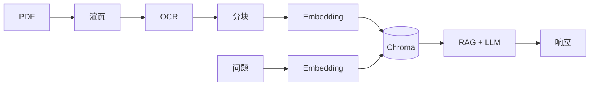

- [x] **PDF 解析方案**：所用库、如何处理扫描版、表格/混排是否覆盖。

  - 所用库：**PyMuPDF（`pymupdf`）** 将每页渲染为位图；**Tesseract（`pytesseract`）** 对整页图像 OCR，默认 `chi_sim+eng`。
  - 扫描版：不依赖可选中文字层，按页光栅化后 OCR，并保留 **1-based 页码**。
  - 表格 / 混排：**未单独做**表格检测或结构化还原；表格与正文一并经 OCR 为线性文本，检索可能命中但不保证版面与单元格语义。

- [x] **知识库构建**：分块策略、Embedding 模型、向量库及**选型理由**。

  - 分块：按 OCR 文本中的**标题行**切分（`chunking.chunk_by_headings`，匹配章节号、附录、Markdown 标题等模式），块内带 `start_page` / `end_page` 等元数据。
  - Embedding：默认 **OpenAI `text-embedding-3-small`**（可用 `OPENAI_EMBEDDING_MODEL` 覆盖）。
  - 向量库：**Chroma** 磁盘持久化（默认 `data/chroma_db`），距离空间为 cosine。
  - 选型理由：Chroma 集成轻量、适合原型；该 Embedding 成本与效果较均衡；标题分块与标准/手册类文档结构较匹配。

- [x] **Docker**：可复现的构建与运行命令。

  ```bash
  docker build -t agent-homework .
  export OPENAI_API_KEY="sk-..."
  mkdir -p data/chroma_db data/parsed
  
  # 挂载整个 data，以便 chroma_db 持久化且在宿主能看到「调试导出」的 txt（写在 data/parsed）
  docker run --rm -e OPENAI_API_KEY -v "$(pwd)/data:/app/data" agent-homework \
    python chroma_store.py --reset --export-text

  docker run --rm -p 8000:8000 -e OPENAI_API_KEY -v "$(pwd)/data/chroma_db:/app/data/chroma_db" agent-homework
  ```

- [x] **API 示例**：至少提供 **curl** 调用示例（加分项可补充 Postman）。

  ```bash
  curl -s -X POST "http://127.0.0.1:8000/chat" \
    -H "Content-Type: application/json" \
    -d '{"question":"你的问题","conversation_id":"user_123"}'
  ```

  Postman：`POST`，URL 同上，Body 选 raw JSON，字段与上面 `-d` 一致即可。

- [x] **实际完成用时**：约 4 小时。

- [x] **已知问题 / 待改进**（若无则写「无」或简要说明范围边界）。

  OCR 与分块受扫描质量、识别错误影响；无专门表格解析；`conversation_id` 预留但未实现多轮记忆；仅向量检索、无混合检索；首次使用需先执行 `chroma_store` 写入向量库，否则问答无检索上下文。

设计思路、架构图、解析管线说明。

- **设计思路**：离线 OCR → 标题分块 → Embedding 写入 Chroma；在线对问题 Embedding，Top-K 检索拼上下文，调用 Chat 模型生成 `answer` / `sources` / `confidence`。
- **解析管线**：PDF → PyMuPDF 渲页 → Tesseract 按页 OCR → 带页码的文本 → 标题分块 → 向量化 → Chroma。
- **架构图**：


